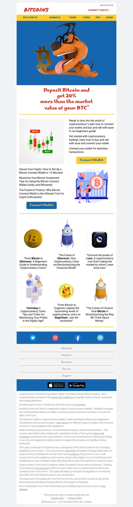

# CryptoCurrency-Promotional-Email
Custom hand-coded HTML inline CSS Promotional Email. 
Custom unbranded created all content, layout, logo, and idea.  
<a style="font-size: 14px; font-family: Arial, Helvetica, sans-serif; color: #8a8a8a;" href="https://www.freepik.com/free-photo/fun-dog-3d-illustration_14197632.htm#query=bitcoin%20cartoon&position=20&from_view=keyword&track=ais">Image of Bitcoin Dog by julos</a> on Freepik background and size edited by me. Beautiful 3D images are made by a few very good designers on <a style="font-size: 14px; font-family: Arial, Helvetica, sans-serif; color: #8a8a8a;" href="https://unsplash.com/">Unsplash.com.</a>

- Live Site URL: [Add live site URL here](https://ryoshi1001.github.io/CryptoCurrency-Promotional-Email/)

Built with:
- HTML5 
- CSS Inline / Custom properties
- Responsive-Design
- Ghost Tables
- Visual Studio Code
- Figma
  
The designs were created to the following widths:
- Max-width: 600px
  
## Colors
Orange: #F7931A
Red: #cf3d31
Yellow/Gold: #fecc28

## Typography
- Family: [Marhey](https://fonts.google.com/specimen/Marhey?query=marhey)

